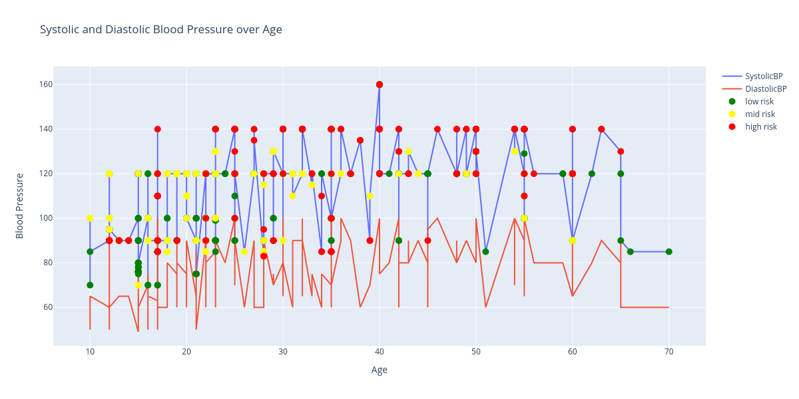

# jupyter-kesehatan
Menampilkan grafik data kesehatan menggunakan pandas dan plotly dengan IDE Jupyter Notebook

# Cara menjalankan program
1. Python yang digunakan minimal versi 3.5 ke atas
2. Buat virtual environment dengan perintah `python3 -m venv venv`
3. Aktifkan virtual environment dengan perintah
    - Linux: `source venv/bin/activate`
    - Windows: `venv\Scripts\activate`
4. Install library yang dibutuhkan dengan perintah `pip install -r requirements.txt`
5. Jalankan program dengan perintah `jupyter notebook`
6. Buka browser dan akses `http://localhost:8888` atau `http://127.0.0.1:8888/`
7. Pilih file `grafik_kesehatan.ipynb`
8. Jalankan program dengan menekan tombol `Run` atau dengan menekan tombol `Ctrl + Enter` di setiap cell kode yang ada