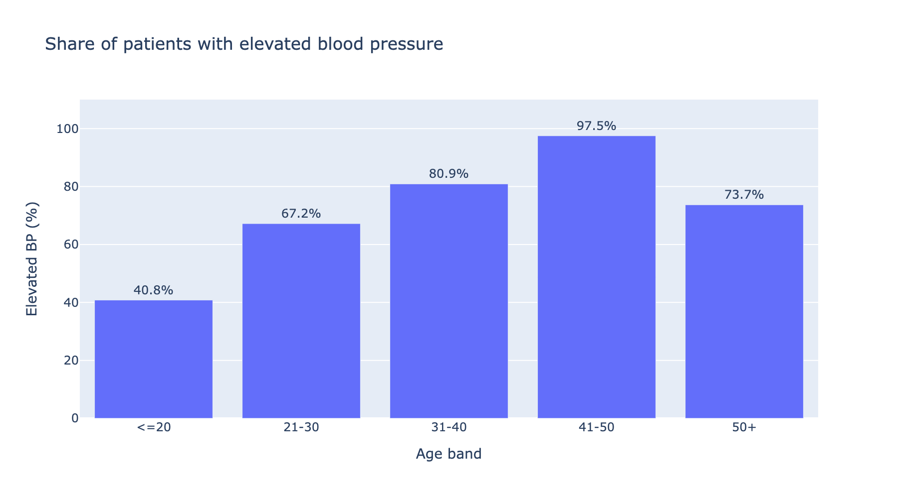
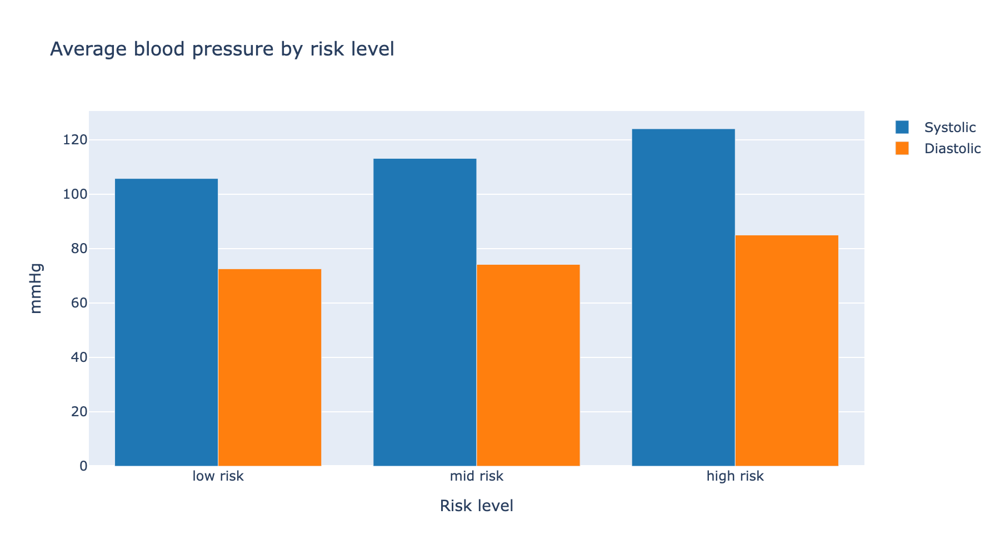

# Health Data Analysis

Exploratory analysis of **1,014 patient health records**, looking at how vital
signs — blood pressure, body temperature and heart rate — relate to age and to an
overall risk level. Built with pandas and Plotly in a Jupyter notebook.

## Why this project

Real-world data is rarely perfectly tidy. This project takes a raw health dataset,
cleans it up (a duplicated unit column, an awkward column name, a few missing
readings), and turns it into clear, interactive charts that flag readings outside
the healthy range. The focus is on clean, reproducible analysis and on
communicating findings, not on fancy modelling.

## Dataset

Source: `data/data_kesehatan.xlsx` (1,014 rows).

| Column | Meaning |
| --- | --- |
| `Age` | Patient age (years) |
| `SystolicBP` / `DiastolicBP` | Blood pressure (mmHg) |
| `body Temp (celcius)` | Body temperature (°C) |
| `HeartRate` | Heart rate (bpm) |
| `RiskLevel` | Labelled risk: low / mid / high |

## What's inside

The notebook ([`health_data_analysis.ipynb`](health_data_analysis.ipynb)) walks
through:

- Data preparation (drop the duplicated Fahrenheit column, rename the temperature
  column, handle missing readings)
- Dataset overview and summary statistics
- Risk level distribution
- Blood pressure vs age, with normal/elevated flags
- Share of elevated blood pressure by age band
- Blood pressure by risk level
- Body temperature and heart rate distributions

## Key findings

- **Blood pressure is the dominant signal** — about two thirds of patients show
  elevated blood pressure (systolic ≥ 120 or diastolic ≥ 80 mmHg).
- **It rises sharply with age**, from ~41% of patients aged 20 and under to ~98% in
  the 41–50 band.

  

- **The risk labels line up with the vitals** — high-risk patients average ~124/85
  mmHg versus ~106/73 mmHg for low-risk ones.

  

- **Temperature and heart rate are stable** — ~20% of temperatures fall outside the
  normal band, while every heart-rate reading sits within the healthy 60–100 bpm
  range.

## Running it

Requires Python 3.10+.

```bash
python3 -m venv .venv
source .venv/bin/activate        # Windows: .venv\Scripts\activate
pip install -r requirements.txt
jupyter notebook health_data_analysis.ipynb
```

Then run the cells top to bottom (Run All) — the notebook is self-contained and
reproducible.

## Tech stack

Python · pandas · Plotly · Jupyter
